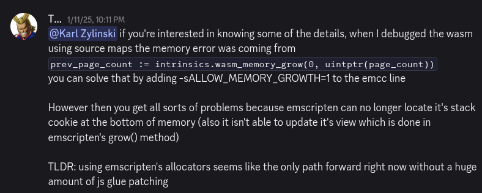

# Thoughts on cross-compiling native / web
I recently made a little math tool using Raylib and Odin. It allows you to visualize what matrix math looks like.

<iframe frameborder="0" src="https://itch.io/embed-upload/19261103?color=333333" allowfullscreen="" width="100%" height="740"><a href="https://synthasmagoria.itch.io/transformation-visualizer">Play Transformation Visualizer on itch.io</a></iframe>

Here's the source code: [https://offgrd.xyz/git/Synthasmagoria/transformation_visualizer](https://offgrd.xyz/git/Synthasmagoria/transformation_visualizer)

The reason I thought I could do this at all was 3 things:
- Karl Zylinski had made a Raylib Odin template that I had previously used for [Side-Exit](https://synthasmagoria.itch.io/side-exit)
- Raysan has made lots of [really cool tools](https://raylibtech.itch.io/) for Raylib that run on web
- A good friend of mine whith whom I'm developing a [multplayer game](https://playogi.com/mullar) has inspired me to try targeting web

I have done a few things on web in the past, and the main pain point for me was always the debugging. Having to use a completely different debugger in the browser from the one I'm used to using for native was a big drawback. So being able to target web without having to debug on the web sounded like a good idea.

## Honeymoon phase
Everything was great on the native side of things. After having briefly tested [Clay](https://www.nicbarker.com/clay) and [MicroUI](https://github.com/rxi/microui) for UI layout I decided to make [my own tiny immediate mode UI layout](https://offgrd.xyz/git/Synthasmagoria/snths_ui) library. I vendored in the latest Raylib and used its makefile to remove any parts I didn't need. To my delight I managed to get a working build down to 140kb on linux. I ended up making [my own Raylib template](https://offgrd.xyz/git/Synthasmagoria/raylib_project_template) with the custom settings made easy to access, Raylib+Raygui source code and the [odin-c-bindgen](https://github.com/karl-zylinski/odin-c-bindgen) sjson configs so that I can keep updating Raylib for my Odin projects in the future. My project was compiling for web, and things were going great so I added a bunch of features. Many features later I wanted to make a test build to put on itch, and that's when I realized how wrong things had been going without me noticing.

## Setting out
The point of using Emscripten is that you won't have to worry about the web platform layer. The problem is that when it breaks and gives you an error like this:
```
/home/synthas/.local/odin/base/runtime/wasm_allocator.odin(86:3) panic: wasm_allocator: initial memory could not be allocated
```
you will have to start owning what you're using regardless.

What I found out later is that this error was caused by a little detail I had messed up when adapting Karl's template: Namely, I forgot to set Odin's allocator to the custom Emscripten allocator that Karl had made. I didn't know this at the time so I started digging down.

## Shallow waters
My first target: Odin's WASM allocator. The error message above comes from when it first allocates memory. And the order is this:
1) I try to allocate some memory (which calls `wasm_allocator_proc`)
2) `wasm_allocator_proc` -> `wasm_allocator_init` -> `claim_more_memory` -> `alloc` -> `page_alloc` -> `intrinsics.wasm_memory_grow`

And that's where the first trail ends. `intrinsics.wasm_memory_grow` lives in Odin's base:intrinsics library. This function was returning `-1`. Not an error code that could tell me why it was failing, just that it was failing. As I tend to do when running into dead ends like this I check the discord server and found the following post:



## Emscripten roulette
At this point I was about ready for some guesswork experimentation. So I cross referenced by build script's with Karl's - of course this wouldn't lead to anything since it's not the part I messed up. I was thinking that this could be an Emscripten version difference problem. And indeed, Emscripten updates very frequently.

Just this year version 6 had released, and this was before Karl's template. So I ended up testing if Karl's template would work on the current emscripten version, and it did, so that's wasn't it.

Next I wanted to know more about `emcc`'s build flags. Maybe something had changed in recent versions. And indeed between 6.0.2 (2026.07.01) and 6.0.3 (2026.07.13) they had [changed the defaults of the GROWABLE_ARRAYBUFFERS flag](https://github.com/emscripten-core/emscripten/releases/tag/6.0.3). I had been on version 6.0.2 up until this point. So I tried updating to the latest, which was 6.0.9 at the time. But this didn't change anything.

I also tried experimenting with the other `emcc` flags and ended up getting different errors that I didn't find very enlightening.

## Here be dragons
I kept on digging down at this point. I wanted to figure out why `intrinsics.wasm_memory_grow`was returning -1. But there wasn't any Odin source code for me to dig further into at this point. Therefore the next stop was the Odin compiler.

There I found out that all of the Odin intrinsics are contained within a switch statement switching on an enum called `BuiltinProcId`. And it in turn calls `BuiltinProc_wasm_memory_grow`, which then calls `LLVMLookupIntrinsicId` with `"llvm.wasm.memory.grow"` as a string parameter.

Great, that means I have something concrete to look up. LLVM itself is very well documented as documented by jblow himself:
https://www.youtube.com/watch?v=92kcm3b-Q_s
Therefore I should be able to figure out what `"llvm.wasm.memory.grow"` does. But no! It isn't documented in the official [LLVM intrinsics list](https://llvm.org/docs/LangRef.html#intrinsic-functions). At this point some of the more knowledgeable people might be rolling their eyes: "of course it isn't documented because it's dead simple" they say. Yes, and I did figure this out when I looked at the LLVM [TableGen](https://llvm.org/docs/TableGen/index.html) files related to the intrinsic.
```
defm MEMORY_GROW_A#B : I<(outs rc:$dst), (ins i32imm:$flags, rc:$delta),
                         (outs), (ins i32imm:$flags),
                         [(set rc:$dst,
                           (int_wasm_memory_grow (i32 imm:$flags),
                             rc:$delta))],
                         "memory.grow\t$dst, $flags, $delta",
                         "memory.grow\t$flags", 0x40>;
}
```

There it is! I don't know how TableGen works, I don't know how most of the code in this snippet works. But even my feeble eyes could see it.

`memory.grow`

A single WASM instruction.

## 
Recap: I just want to find out why my WASM memory fails to grow.
So far I've gone through:
- The Odin base library source code to look at `wasm_allocator`
- The Odin compiler source code to find `intrinsics.wasm_memory_grow`
- The LLVM source code to find `"'llvm.wasm.memory.grow'`

And now, finally, the WASM Spec to look for the `memory.grow` instruction.

The [Mozilla's docs](https://webassembly.github.io/spec/core/appendix/changes.html#extension-gc) say that `memory.grow` will fail with `-1` but not why. Classic.

The [WASM spec](https://webassembly.github.io/spec/core/syntax/instructions.html#memory-instructions) lists `memory.grow` but also only says that it fails with `-1`. More annoyingly it isn't possible to search the spec for "memory.grow" with CTRL+F since they've used weird text formatting.

I checked some other parts of the spec as well and wasn't able to find any additional information. And that's where I gave up the hunt. I had looked through a lot of things and hadn't found a single good clue. Was I just looking in the wrong place all along? Knowing what I know now I fail to imagine that anyone responsible for any of the many technologies involve in my project could take responsibility for the error I made. Sure, Emscripten made this error harder to diagnose, [Odin does not target Emscripten](https://forum.odin-lang.org/t/so-many-different-wasm-build-targets/790/4) for reasons that I'm now starting to grasp, and the WASM spec is hard to search. But the main issue was that I did not know how to isolate the problem, and admittedly I don't know that much about WASM, meaning I cannot predict in which ways the memory instructions might fail.

This is the point where I randomly find out about the allocator issue while doing my third cross-reference with the Karl template.

## The lesson
When I'm working with new technologies I tend to start with something simple and then introduce new things as I go. Had I done this project using Karl2D which eliminates the need for Emscripten then I could have avoided this whole round trip. Alternatively I could have found a way to compile Raylib without using Emscripten - though I'm not sure if this is even easily doable at this point.

I was discussing how WASM in browsers (you can run WASM outside of browsers too) with a friend of mine. Back then I said I was sure that it would get adapted more as time goes on. My reasoning back then was that being able to work in better programming languages than JavaScript is something experienced developers will appreciate (next to the performance benefits of course). He was more sceptical about it, stating that he wasn't sure there would be sufficient community support for it. And having gone through this endeavor, as well as dealing with [another bug](https://github.com/raysan5/raygui/issues/574) relating to keyboard input that I could write an equally long blog post about, I can see where he's coming from.

If I do another web+native project, I'll consider dropping emscripten and just do WebGPU directly instead of going through Raylib. I do still love Raylib though. <3
