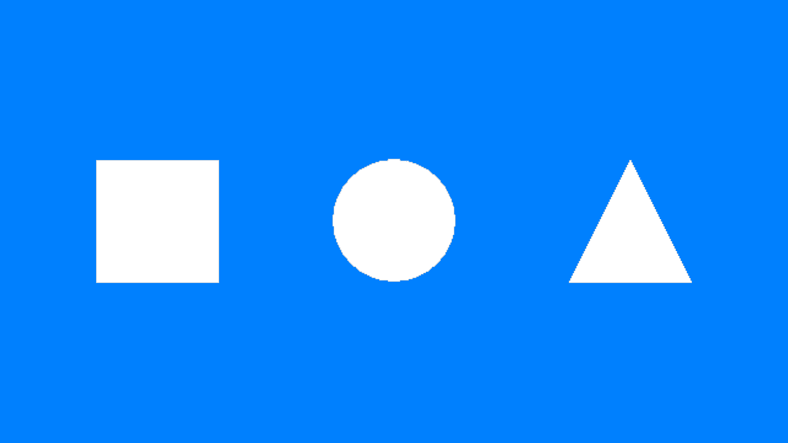
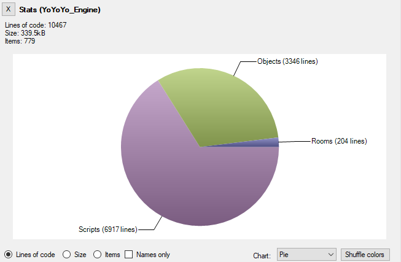
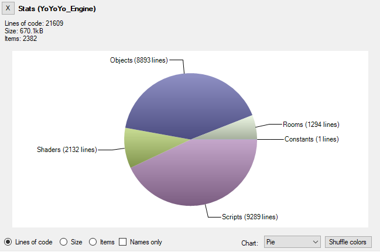
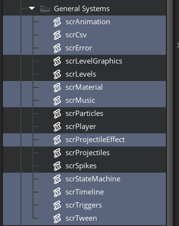

# Extensions and Complexity

## The case for and against TweenGMS
I have used TweenGMS for a decently long time. It's a really cool extension that does exactly what I need it to. It turns animations such as these into really one-liners:

*This is pseudocode*
```gml
TweenFire(square, EaseInOutBounce, TweenMode.Repeat, true, 0, 2, "image_angle", 0, 360);
TweenFire(circle, EaseInOutSine, TweenMode.Repeat, true, 0, 2, "y", ystart + 64, ystart - 64);
TweenFire(triangle, EaseInOutQuad, TweenMode.Repeat, true, 0, 2, "scale", 1, 2);
```



Though, most of the time all I use is two functions: [TweenFire](https://stephenloney.com/_/TweenGMS/120/TGMS_Script_Reference.html#TweenFire) - to quickly animate a variable - and [TweenAddCallback](https://stephenloney.com/_/TweenGMS/120/TGMS_Script_Reference.html#TweenAddCallback) - to make something happen once the tween has finished.

As a result of having a lot of extra functionality the extension is pretty huge, sitting at about 8000 lines of GML. The reason I know this is because when I was developing [P2](https://github.com/Synthasmagoria/iwbtp2-source) - a stage of platforming for a collaborative project - I used an LOC counting program. These were the results:


*This is the LOC count I started with (base assets for the project + TweenGMS)*


*This is the final LOC count for the project*

Which means TweenGMS takes up about 40% of my project's code base on its own.

`8000 / 20000 = 0.4`

When you're contributing to a GMS1 project, adding anything extraneous is bound to add a consequential amount of compilation time. Which makes the project harder to maintain over time (not least because the GMS1 compiler doesn't cache things very well). So it is hard not to say that it would benefit the project to get rid of at least some of this code. Though, I had already gone past my deadline so I didn't have the time to make a lightweight replacement.

Later, during the development of a project in GM8.2 I found that it would be a pain to port TweenGMS. I wanted my beloved `TweenFire` back.

The question became: how long would I spend porting TweenGMS vs. how long would it take me to remake the base functionality of TweenGMS that I use? I decided to give the latter a shot and in about an hour I had an object that looked something like this:


- Create event:
```gml
target = noone;
easing = MCEaseLinear;
variable_name = "";
duration = 0;
startValue = 0;
endValue = 0;
signal_init();
signal_add("end");

progress = 0;
time = 0;
value = 0;
```

- Step event:
```gml
if (!instance_exists(target)) {
    instance_destroy();
    exit;
}
time += 1.0 / room_speed;
fraction = time / duration;
if (fraction >= 1.0) {
    value = endValue;
    variable_instance_set(target, variable_name, endValue);
    signal_emit("end");
    instance_destroy();
} else {
    value = (endValue - startValue) * script_execute(easing, fraction) + startValue;
    variable_instance_set(target, variable_name, value);
}
```

Combined with some easing functions which were easily recreated in GML by referencing this website: [https://easings.net/](https://easings.net/). And a helper function with which to create the tween:
```gml
///MCTweenFire(target, easing, varname, duration, start, end)
var _tween;
_tween = instance_create(0, 0, MCTween);
_tween.target = argument0;
_tween.easing = argument1;
_tween.variable_name = argument2;
_tween.duration = argument3;
_tween.startValue = argument4;
_tween.endValue = argument5;
variable_instance_set(argument0, argument2, argument4);
return _tween;
```
And voila, I could tween to my heart's content (or at least within the limits of my system). This got me 90% of the way to what I wanted, and I could make up for the other 10% by just coding a bit differently.

I feel like I have made the case for why you would want to consider writing your own lightweight version of a system for GMS1, but we're now mostly using modern GameMaker (with the exception of [certain communities](https://cwpat.me/fangames-intro/)). Where GMS1 would work at the pace of a dead snail, modern GM opens your game relatively quickly. So what is even the point of making your own systems, and optimize for code size and minimal complexity?

## You can make small systems
Consider these cases:

### "I need SDF fonts and a typewriter effect":
- You could use [Scribble](https://github.com/JujuAdams/Scribble/tree/master) (20_000+ LOC)

**or**

- Or you could use [GameMaker SDF font functions](https://youtu.be/uxLVOwBd63o?si=qkDt_BeMHPznR41Z) + using string functions to create a typewriter (about 50 lines of code)

### "I need signals / an observer pattern implementation":
- You could use [Pulse](https://refreshertowel.itch.io/pulse)

**or**

- You could implement the [pattern yourself for free in 50 lines of code](https://youtu.be/B_rbNxNllgA?si=VLcNFucvRhzEtpDQ)

### "I need an in-game developer console":
- You could use [rt-shell](https://github.com/daikon-games/rt-shell)

**or**


- You could use [keyboard_string](https://manual.gamemaker.io/monthly/en/index.htm#t=GameMaker_Language%2FGML_Reference%2FGame_Input%2FKeyboard_Input%2Fkeyboard_string.htm&ux=search) and [string_split](https://manual.gamemaker.io/monthly/en/GameMaker_Language/GML_Reference/Strings/string_split.htm) to implement an input field where the first typed word looks for a function to execute in a [ds_map](https://manual.gamemaker.io/monthly/en/index.htm#t=GameMaker_Language%2FGML_Reference%2FData_Structures%2FDS_Maps%2FDS_Maps.htm) (about 100 lines of code)

## The case for autonomy

As a developer it is important to be able to read source code for the sake of understanding what it does. Not necessarily to be able to modify it - especially in the case of extensions - but to be able to understand the rammifications to using a large system.

A good example of what I'm talking about is [Scribble](https://github.com/JujuAdams/Scribble/tree/master)'s cache. You're expected to learn how to use the extension's functions in an efficient manner as to not overburden the hidden cache - which could lead to performance problems. And the two ways to learn about this is to:

- Option A: Read the documentation
- Option B: Read the source code

Option A has limited information, while option B takes a lot of time. So unless you really needed scribbles features it is definitely worth asking: is the time spnet to understand scribble worth sacrificing?

Carefully considering the pros and cons of using extensions has given me more autonomy than I would otherwise have. For [K3+](https://redbatnick.itch.io/iwktk3plus) I have made numerous little systems that might have otherwise entered the project as an extension:
- A timeline replacement that streamlines skipping functionality (discussed in [this article](https://redbatnick.github.io/Rosie_Times_Ahead/)) - 200 lines of code.
- A buffer-based string builder - 30 lines of code.
- A CSV parser - 50 lines of code
- [Materials](https://synthasmagoria.github.io/materials_in_gm/) - 100 lines of code for minimal implementation. 300 lines of code after modification in K3+
- ... the list goes on

All of the above things have been made before by people who are more dedicated and capable than I am. But, considering the time it took to make each of these components and the autonomy gained as a result, it was well worth it to "reinvent the wheel". When the time comes to make changes to these little systems there will be very little doubt or hesitation for whether we *can*, or whether we should check the bug tracker of an external project. We own lots of these little components, and the complextiy cost is small.



*Scripts containing small systems in K3+*

## Conclusion
Now I'm not about to say that artists should start thinking like programmers, and not use extensions for things that can be easily recreated by an experienced programmer. But for people who are predominantly programmers: please consider this as an option. Your project is most likely going to be better of if you consider what you need versus the cost of using large extensions - namely: adding a lot of code and possibly complexity to your project.
