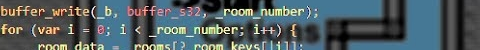

# Synthasmablogia
Programmer, tool developer, game man.

## Links
- Games: [https://synthasmagoria.itch.io/](https://synthasmagoria.itch.io/)
- Source GitHub: [https://github.com/Synthasmagoria/](https://github.com/Synthasmagoria/)
- Source offgrd: [https://offgrd.xyz/git/Synthasmagoria](https://offgrd.xyz/git/Synthasmagoria)

## Videos
### [GMS1 Compiler optimization hacking](https://youtu.be/9xO-IdB6qrk?si=CAvWzWtVH4Lz0LQS)

### [P2 Technical commentary](https://youtu.be/6BTvtxywboQ?si=J9Lh4XxnUTV7L4Yt)

### [Bringing Godot-like signals to GameMaker](https://youtu.be/B_rbNxNllgA?si=uTvfgs07dAMsfp1I)

## Writing
- [Error handling in GM](error_handling_in_gm/index.html)
- [Materials in GM](materials_in_gm/index.html)

## Tools
### GameMaker
- [GM Odin Extension gen](https://offgrd.xyz/git/Synthasmagoria/gamemaker_regenerate_extension)
- [GM Enum Reflection gen](https://offgrd.xyz/git/Synthasmagoria/gamemaker_enum_reflection_gen)

### GameMaker Studio 1
- [GMCollage](https://github.com/Synthasmagoria/gmcollage-python)
- [LDtk-GMS](https://github.com/Synthasmagoria/LDtk-GMS)
- [GMS1 Inspector](https://offgrd.xyz/git/Synthasmagoria/gamemaker-studio-inspector)
