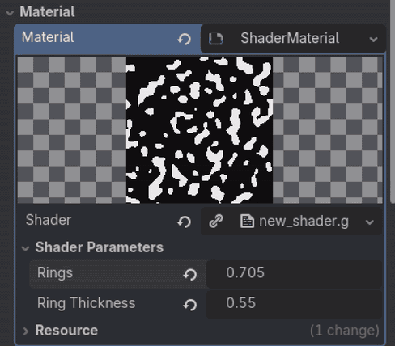
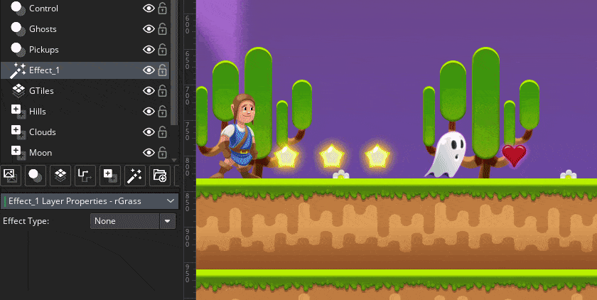
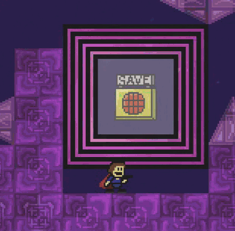
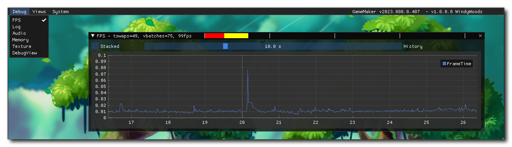
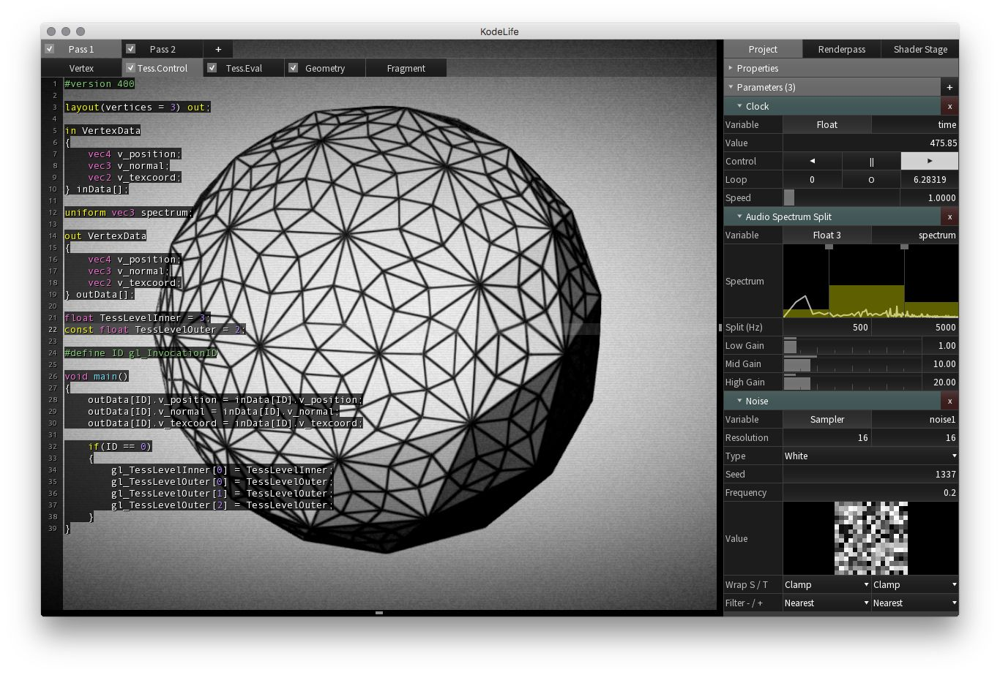

# Materials in GameMaker
This article is going to go through how you can use the newly added [ImGUI dbg_](https://manual.gamemaker.io/lts/en/#t=GameMaker_Language%2FGML_Reference%2FDebugging%2FThe_Debug_Overlay.htm&ux=search) functions in GameMaker to make your shader parameters editable while your game is running. This approach is currently being used in the development of [K3+](https://redbatnick.itch.io/iwktk3plus). And is discussed in the [latest devlog](https://redbatnick.github.io/Rosie_Times_Ahead/).


## What are "Materials"?

If you're familiar with using shaders then you've probably seen the following pattern plenty of times.

```gml
shader_set(shader);
shader_set_uniform_f(shader_get_uniform(shader, "<variable name>"), val);
// Repeat based on the number of uniforms
draw_self(); // or some other drawing function that's supposed to have the shader effect applied
shader_reset();
```

This is standard for GameMaker, but other game engines handle this process very differently. Instead of setting uniforms directly, you'll often change the variables in a "material", either using code, or with slider's, color pickers etc. in the editor.



GameMaker has this feature in the form of layer effects but is very limited since you cannot add your own shaders to it.



One of the most annoying things about making shaders and applying them in GameMaker is the lack of control you have over them. So having a sort-of-material would be a great help. But there'd be other benefits as well such as:

- Being able to set defaults for shader uniforms
- Copy and reuse shader uniforms in different contexts

So, what would a simple implementation of materials in GameMaker look like?

## Making basic materials
When I say "materials" really all I mean is storing the values that are passed as uniforms in some struct. This is quite easy to make.

Start by making an enum containing all of the types we want to be able to pass as uniforms.
```gml
enum MaterialUniformType {Float, Vec2}
```

Then create a struct that can hold these values. In my case I'll go for a struct containing the uniforms and a value to contain the shader.
```gml
function Material(shader) constructor {
	self.uniforms = {};
	self.shader = shader;
}
```

Additionally I need to be able to keep the type information of the uniforms to be able to pass them to the shader properly. So I'll create another struct for this:
```gml
function MaterialUniform(value, type) constructor {
	self.value = value;
	self.type = type;
}
```

Then implement a function per data type for adding the different uniform values:
```gml
function material_add_float(mat, key, val) {
	var _uniform = new MaterialUniform({x: val}, MaterialUniformType.Float);
	variable_struct_set(mat.uniforms, key, _uniform);
}

function material_add_vec2(mat, key, x, y) {
	var _uniform = new MaterialUniform({x: x, y: y}, MaterialUniformType.Vec2);
	variable_struct_set(mat.uniforms, key, _uniform);
}
```

And finally, create the function that passes the uniforms to the set shader using the material, as well as an optional function that sets the shader:
```gml
function material_apply(mat) {
	var _names = variable_struct_get_names(mat.uniforms);
	var _sh = shader_current();
	for (var i = 0, n = array_length(_names); i < n; i++) {
		var _uniform = variable_struct_get(mat.uniforms, _names[i]);
		switch (_uniform.type) {
		case MaterialUniformType.Float:
			shader_set_uniform_f(
				shader_get_uniform(_sh, _names[i]),
				_uniform.value.x);
			break;
		case MaterialUniformType.Vec2:
			shader_set_uniform_f(
				shader_get_uniform(_sh, _names[i]),
				_uniform.value.x,
				_uniform.value.y);
			break;
		// Add more types as needed
		}
	}
}

function shader_set_material(mat) {
	shader_set(mat.shader);
	material_apply(mat);
}
```

The workflow of applying shaders has gone from this
```gml
#event create
sh = shShader;
time = 0.0;
factor = new Vec2(0.0, 0.5);

#event draw
time += 1.0 / 60.0;
shader_set(sh);
shader_set_uniform_f(shader_get_uniform(sh, "time"), time);
shader_set_uniform_f(shader_get_uniform(sh, "factor"), factor.x, factor.y);
draw_self();
shader_reset();
```

To this:
```gml
#event create
material = new Material(shShader);
material_add_float(material, "time", 0.0);
material_add_vec2(material, "factor", 0.0, 0.5);

#event draw
shader_get_uniform(material, "time").value.x += 1.0 / 60.0;
shader_set_material(material);
draw_self();
shader_reset();
```

Which is roughly the same amount of code, but very different considering that the instance is no longer dependent on having specific code in it in order to draw the specific shader effect.

You could strip it down to the following:
```gml
#event create
material = new Material(shShader);

#event draw
shader_set_material(material);
draw_self();
shader_reset();
```

And then create the instance with any shader and applied uniforms like so:
```gml
var _inst = instance_create_layer(0, 0, "bg_layer", objMaterialTest);
_inst.sh = shCoolBackgroundEffect;
_inst.sprite_index = sprCoolBackgroundSprite;
material_add_vec2(_inst.material, "parameters", 34.0, 19.44);
```

This kind of thing is also useful in cases where a shader is used in a bunch of places and we want to be able to set certain defaults. e.g. A shader that has the ability to shift the hue, grayscale, and invert colors.



At any given time we probably just want to be able to use a few of these features so a global material can be created that is copied by everything that wants to use the shader.

```gml
var _m = new Material(shColorization);
material_add_float(_m, "hue", 0.0, 0.0, 0.0);
material_add_float(_m, "grayscale", 0.0);
material_add_float(_m, "invert", 0.0);
global.materials.colorization = _m;
```

Then `variable_clone(global.materials.colorization);` can be used whenever something needs to use the shader:

```gml
#event create
material = variable_clone(global.materials.colorization);

#event draw
shader_get_uniform(material, "hue").value.x += 1.0 / 50.0;
shader_set_material(material);
draw_self();
shader_reset();
```

The pseudo code above would make the instance pulse in all colors.

This is all very useful and makes shaders more easily reusable, albeit, with a performance cost + burdening the GC with a bunch of structs. However, in cases where you want to shade a single element this is a pretty nice approach to doing so. And for a long time this is all that "materials" did in K3+. Though, this changed the day that I found out that GameMaker allows you to customize the profiler.
## It's starting to look more like an "engine feature"

In case you didn't know: you can enable an in-game debug overlay by calling:
```gml
show_debug_overlay(true);
```

It looks like this and has a bunch of really handy debug information in it.


You can read more about it in the manual:
https://manual.gamemaker.io/monthly/en/GameMaker_Language/GML_Reference/Debugging/The_Debug_Overlay.htm

The important part is that the GameMaker devs didn't keep this functionality all to themselves. Instead they wrote some GML bindings for it making it possible for us to add our own windows to this view.

Up until now we've been using [KodeLife](https://hexler.net/kodelife) for creating shaders before porting them to GameMaker. That's because it compiles the shader code you write in it instantly and displays the output on screen so that you can see your changes happen in real time.


It's a good piece of software that I've been using a lot over the years when writing shaders. And I highly recommend giving it a shot, especially if you want to learn how to shaders work.

For K3+ the shader creation process has been the following:
1) Make the shader in KodeLife where it compiles and displays instantly
2) Tweak the shader by setting up uniforms using sliders and color pickers
3) Port it to GameMaker and make final adjustments if needed.

This is a pretty good approach for art shaders such as the ones in the background of many of the levels.


But it gets a lot harder to properly preview the final result when you have to take the foreground elements into account. The artistic process would benefit greatly from being able to tweak the values directly from within the game instead of having to guesstimate, then wait 15 seconds to compile and see the outcome.
It would be great if we could have the sliders and color pickers like in Godot or KodeLife. And with GameMaker's new ImGui support this is relatively easy to set up.

Using the new `dbg_*` functions I built on top of the already existing materials. The system now has two new functions, as well as a few new types:
```gml
function material_uniform_set_display_info(material, key, type, range_min = 0.0, range_max = 1.0) {
	// check gist for implementation
}

function material_add_to_debug_view(mat, name) {
	// ...
}

function material_add_color_rgba(mat, r, g, b, a) {
	// ...
}
```

The workflow stays exactly the same as before for using the material with `variable_clone`. Except now you can call `material_add_to_debug_view` in order to put it into a custom view that allows for the properties to be changed at runtime.


This makes it so much easier to actually get the parameters looking right.
Source code for a drag'n'drop version of the material can be found here: 

[https://offgrd.xyz/git/Synthasmagoria/gamemaker_material](https://offgrd.xyz/git/Synthasmagoria/gamemaker_material)

Nick also wrote a blog post on recent progress briefly touching upon the way we're using materials in development:

[https://redbatnick.github.io/Rosie_Times_Ahead/](https://redbatnick.github.io/Rosie_Times_Ahead/)
