# XoArK Discovery Arc

I started digging through XoArK's discography, and decided to chronicle it.
Sorry my descriptors are so vague. I haven't spent a lot of time with any of this music yet.
The page and 3x3 will be updated for as long as I'm actively listening to XoArK.

[Check out this absolutely photogenic bandcamp page](https://xoark.bandcamp.com/music)

    
<a href="https://xoark.bandcamp.com/album/tiryclui">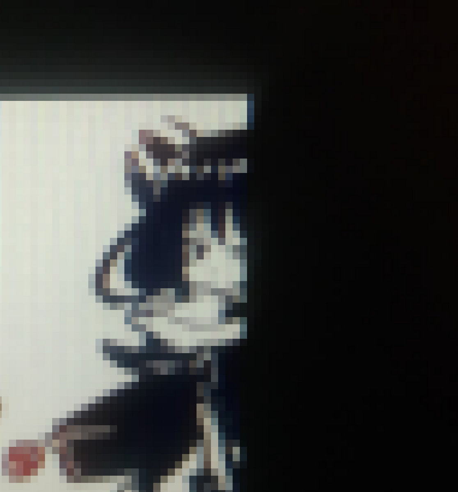</a>

    

    
<a href="https://lego6.bandcamp.com/album/1sky">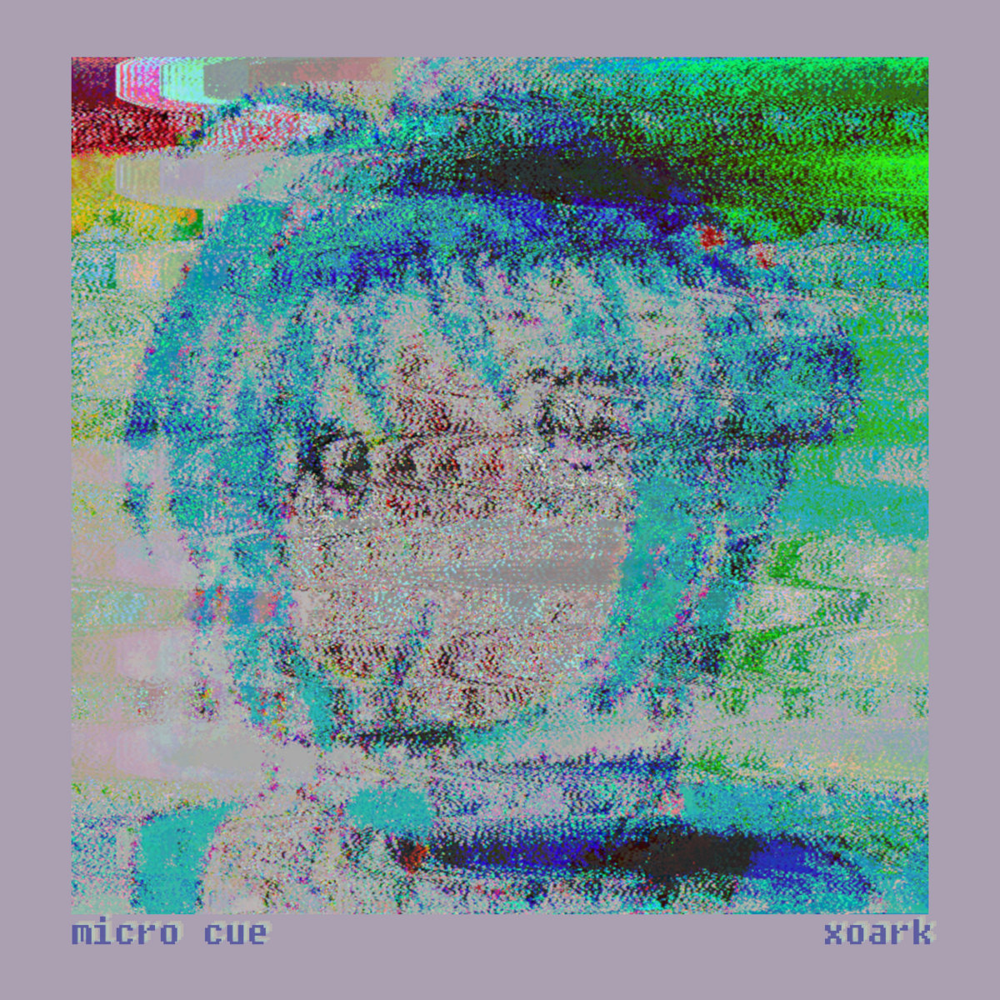</a>

    
<a href="https://xoark.bandcamp.com/album/tailflamed">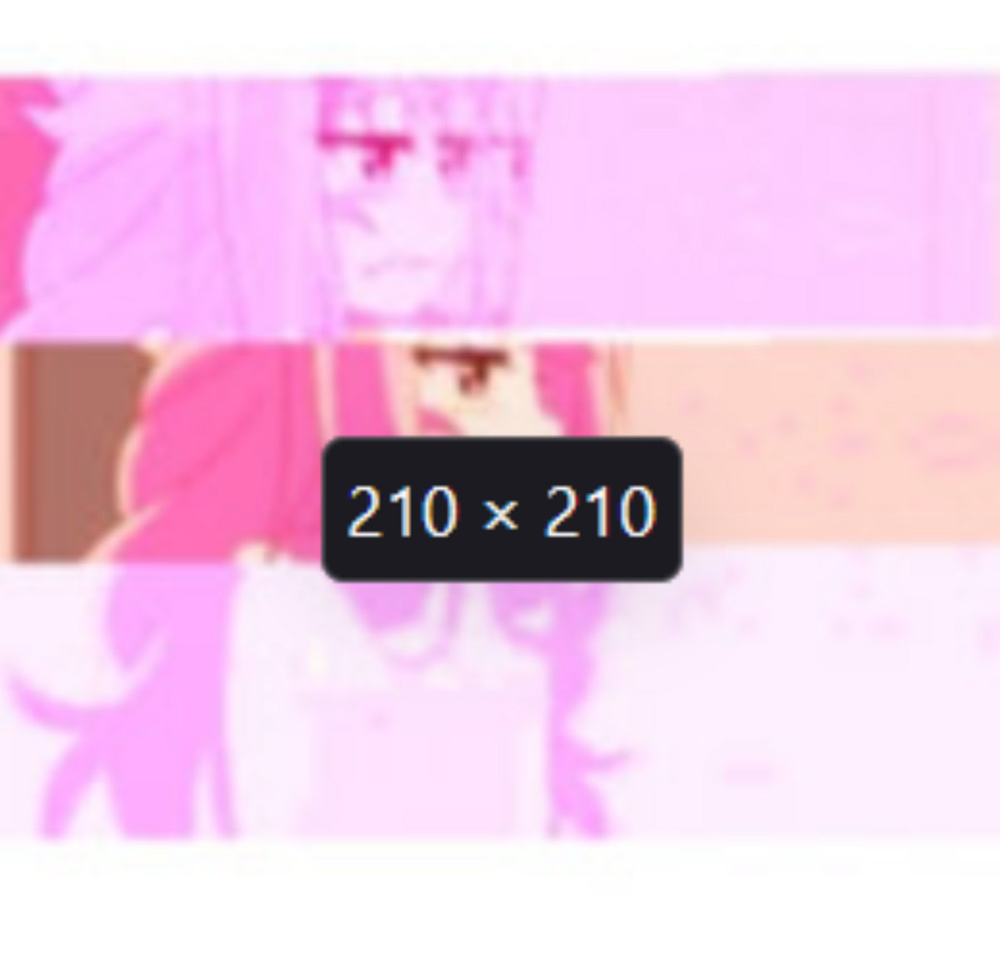</a>

    
<a href="https://suimoe.bandcamp.com/album/see2">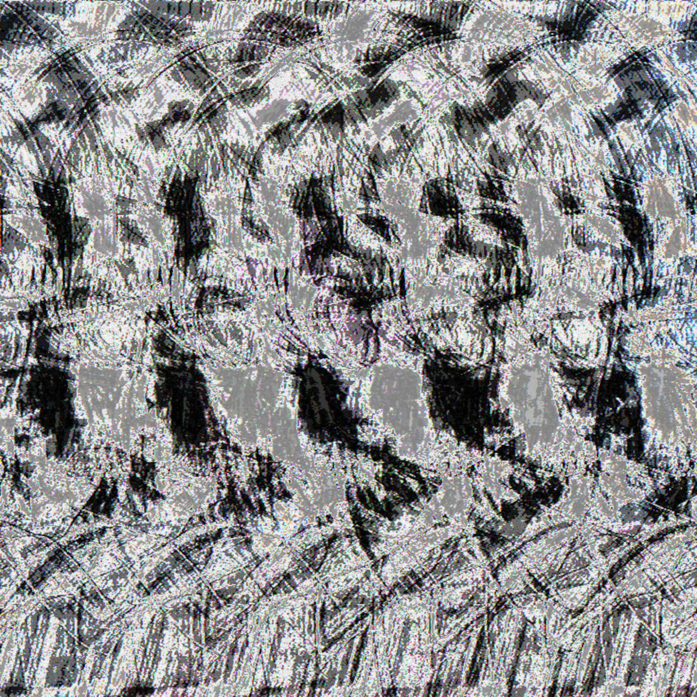</a>

    

    
<a href="https://xoark.bandcamp.com/album/nssrwnt">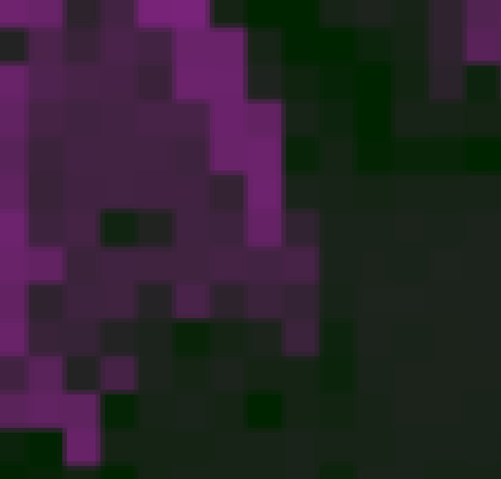</a>

    
<a href="https://xoark.bandcamp.com/album/nemnge">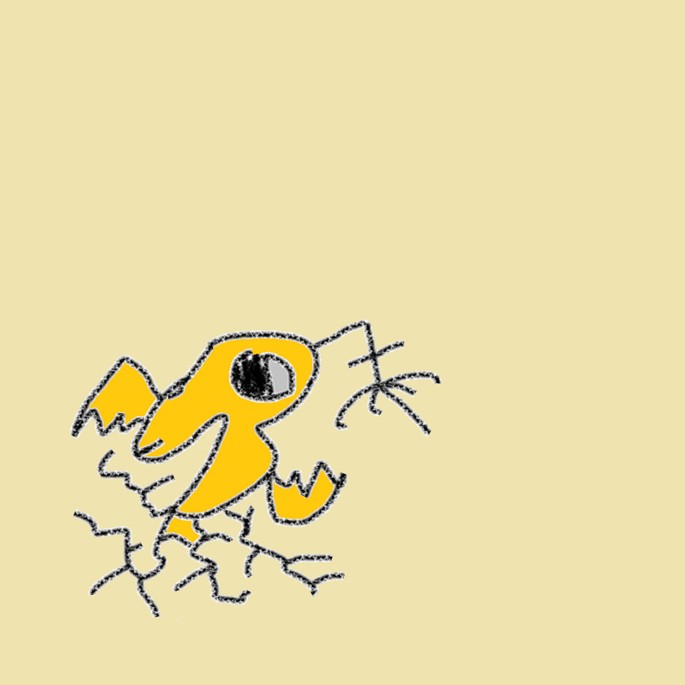</a>

    
<a href="https://xoark.bandcamp.com/album/talprcrii">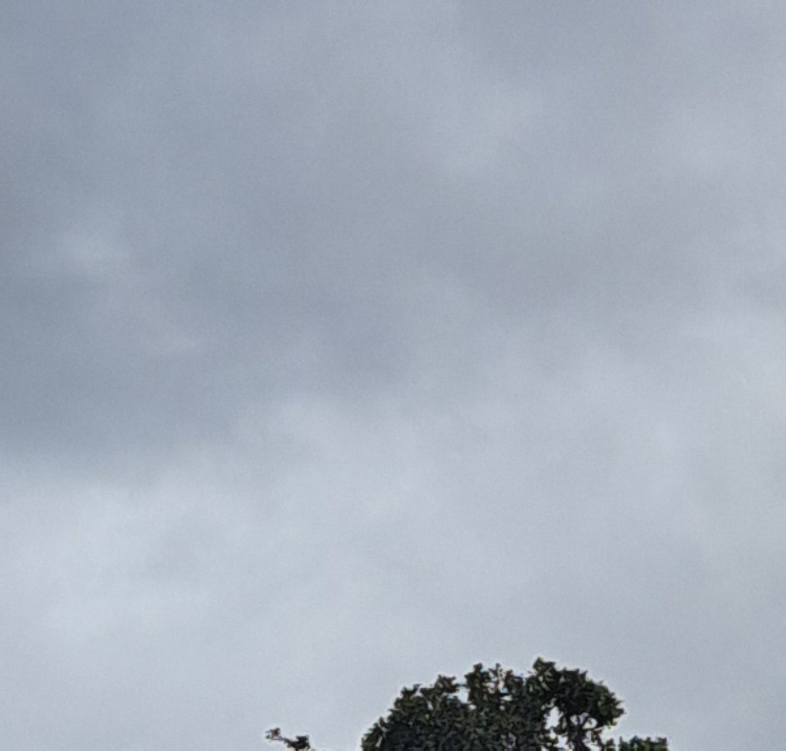</a>

  

*albums not ordered by favorite. here's the albums on the 3x3 from left to right, top to bottom*

1) [Tiryclui](https://xoark.bandcamp.com/album/tiryclui) - Interesting IDM. Second track has a cool sound. And it seemlessly morphs hecticism.
2) [Parfait Retrieval](https://xoark.bandcamp.com/album/parfait-retrieval) - Mostly DnB. Has some interesting sound design and satisfying track progressions.
3) [1sky](https://lego6.bandcamp.com/album/1sky) - Variety. Never heard offbeat piano turn into a DnB track before.
4) [Tailflamed](https://xoark.bandcamp.com/album/tailflamed) - Most consistently energetic breakcore / dnb album I've heard from XoArK to date. A vibe all throughout.
5) [See2](https://suimoe.bandcamp.com/album/see2) - V.A. with a bunch of interesting artists. Ends up being pretty experimental.
6) [Satellits: Descriptor](https://xoark.bandcamp.com/album/satellits-descriptor) - Desolate IDM
7) [Nssrwnt](https://xoark.bandcamp.com/album/nssrwnt) - Eerie ambient journey through a big dataplex.
8) [nemnge](https://xoark.bandcamp.com/album/nemnge) - Cool IDM ambient
9) [talprcrii](https://xoark.bandcamp.com/album/talprcrii) - Hectic IDM

<table style="border:1px solid gray; width:100%; position:relative;">
	<thead>
	    <tr>
    		<th>Listened</th>
    		<th>Released</th>
    		<th>Title</th>
    		<th>Genre</th>
    		<th>Length</th>
    		<th>Like</th>
    		<th>Type</th>
    		<th>Favorite</th>
            <th>f(x)</th>
		</tr>
	</thead>
	<tbody>
        <tr>
            <td class="rating">2026.08.02</td>
            <td class="rating">2024.06.29</td>
            <td><a href="https://suimoe.bandcamp.com/album/see2">See2</a></td>
            <td>Breakcore</td>
            <td class="rating">00:45:54</td>
            <td class="rating">★★★★☆</td>
            <td class="rating">V.A.</td>
            <td>y?</td>
            <td class="rating">1</td>
        </tr>
        <tr>
            <td class="rating">2026.08.02</td>
            <td class="rating">2024.02.11</td>
            <td><a href="https://xoark.bandcamp.com/album/chrolps-nlockpyi">Chrolps / Nlockpyi</a></td>
            <td>Breakcore</td>
            <td class="rating">00:11:44</td>
            <td class="rating">★★☆☆☆</td>
            <td class="rating">E.P.</td>
            <td></td>
            <td class="rating">1</td>
        </tr>
        <tr>
            <td class="rating">2026.08.03</td>
            <td class="rating">2025.06.08</td>
            <td><a href="https://xoark.bandcamp.com/album/tiryclui">Tiryclui</a></td>
            <td>IDM</td>
            <td class="rating">01:23:33</td>
            <td class="rating">★★★★☆</td>
            <td class="rating">Album</td>
            <td>02</td>
            <td class="rating">1</td>
        </tr>
        <tr>
            <td class="rating">2026.08.03</td>
            <td class="rating">2026.05.30</td>
            <td><a href="https://xoark.bandcamp.com/album/parfait-retrieval">Parfait Retrieval</a></td>
            <td>DnB</td>
            <td class="rating">01:12:50</td>
            <td class="rating">★★★★☆</td>
            <td class="rating">Album</td>
            <td>Morphedfeather</td>
            <td class="rating">1</td>
        </tr>
        <tr>
            <td class="rating">2026.08.04</td>
            <td class="rating">2025.12.29</td>
            <td><a href="https://xoark.bandcamp.com/album/tea-flange">Tea Flange</a></td>
            <td>DnB</td>
            <td class="rating">01:11:28</td>
            <td class="rating">★★☆☆☆</td>
            <td class="rating">Album</td>
            <td></td>
            <td class="rating">1</td>
        </tr>
        <tr>
            <td class="rating">2026.08.04</td>
            <td class="rating">2024.11.27</td>
            <td><a href="https://lego6.bandcamp.com/album/1sky">1sky</a></td>
            <td>Breakcore</td>
            <td class="rating">00:34:47</td>
            <td class="rating">★★★★☆</td>
            <td class="rating">Split</td>
            <td>Pstch_n46</td>
            <td class="rating">1</td>
        </tr>
        <tr>
            <td class="rating">2026.08.04</td>
            <td class="rating">2025.07.21</td>
            <td><a href="https://xoark.bandcamp.com/album/satellits-descriptor">Satellits: Descriptor</a></td>
            <td>IDM</td>
            <td class="rating">01:27:14</td>
            <td class="rating">★★★☆☆</td>
            <td class="rating">Album</td>
            <td>Spacewire 02</td>
            <td class="rating">1</td>
        </tr>
        <tr>
            <td class="rating">2026.08.04</td>
            <td class="rating">2025.07.25</td>
            <td><a href="https://xoark.bandcamp.com/album/92b1e4">#92b1e4</a></td>
            <td>IDM</td>
            <td class="rating">00:35:32</td>
            <td class="rating">★☆☆☆☆</td>
            <td class="rating">Journey</td>
            <td></td>
            <td class="rating">1</td>
        </tr>
        <tr>
            <td class="rating">2026.08.05</td>
            <td class="rating">2025.08.01</td>
            <td><a href="https://xoark.bandcamp.com/album/marble-bird-resistor-ep">Marble Bird Resistor</a></td>
            <td>Breakcore</td>
            <td class="rating">00:39:08</td>
            <td class="rating">★★★☆☆</td>
            <td class="rating">E.P.</td>
            <td>Submarine1</td>
            <td class="rating">1</td>
        </tr>
        <tr>
            <td class="rating">2026.08.05</td>
            <td class="rating">2025.02.02</td>
            <td><a href="https://xoark.bandcamp.com/album/nssrwnt">Nssrwnt</a></td>
            <td>Ambient</td>
            <td class="rating">01:09:30</td>
            <td class="rating">★★★★☆</td>
            <td class="rating">Album</td>
            <td>Navscr</td>
            <td class="rating">1</td>
        </tr>
        <tr>
            <td class="rating">2026.08.05</td>
            <td class="rating">2026.08.01</td>
            <td><a href="https://xoark.bandcamp.com/album/silkbuffer-ep">Silkbuffer</a></td>
            <td>Breakcore</td>
            <td class="rating">00:35:45</td>
            <td class="rating">★★★☆☆</td>
            <td class="rating">E.P.</td>
            <td></td>
            <td class="rating">1</td>
        </tr>
        <tr>
            <td class="rating">2026.08.05</td>
            <td class="rating">2024.08.27</td>
            <td><a href="https://xoark.bandcamp.com/album/nemnge">nemnge</a></td>
            <td>Ambient</td>
            <td class="rating">01:05:38</td>
            <td class="rating">★★★★☆</td>
            <td class="rating">Album</td>
            <td>Nihsk</td>
            <td class="rating">1</td>
        </tr>
        <tr>
            <td class="rating">2026.08.06</td>
            <td class="rating">2025.04.27</td>
            <td><a href="https://xoark.bandcamp.com/album/ice-aqautics">Ice Aqautics</a></td>
            <td>IDM</td>
            <td class="rating">00:33:17</td>
            <td class="rating">★★★☆☆</td>
            <td class="rating">Journey</td>
            <td></td>
            <td class="rating">1</td>
        </tr>
        <tr>
            <td class="rating">2026.08.06</td>
            <td class="rating">2025.02.04</td>
            <td><a href="https://xoark.bandcamp.com/album/talprcrii">Talprcrii</a></td>
            <td>IDM</td>
            <td class="rating">00:53:31</td>
            <td class="rating">★★★★☆</td>
            <td class="rating">Album</td>
            <td>01</td>
            <td class="rating">1</td>
        </tr>
        <tr>
            <td class="rating">2026.08.06</td>
            <td class="rating">2025.07.06</td>
            <td><a href="https://xoark.bandcamp.com/album/extracted-75699">Extracted (-75699)</a></td>
            <td>IDM</td>
            <td class="rating">01:04:33</td>
            <td class="rating">★★☆☆☆</td>
            <td class="rating">Album</td>
            <td>44428</td>
            <td class="rating">1</td>
        </tr>
        <tr>
            <td class="rating">2026.08.06</td>
            <td class="rating">2025.01.16</td>
            <td><a href="https://xoark.bandcamp.com/album/2-tracks-01-14-33">2 tracks, 01:14:33</a></td>
            <td>IDM</td>
            <td class="rating">01:14:33</td>
            <td class="rating">★★☆☆☆</td>
            <td class="rating">Album</td>
            <td>21min01sec</td>
            <td class="rating">1</td>
        </tr>
        <tr>
            <td class="rating">2026.08.07</td>
            <td class="rating">2024.11.16</td>
            <td><a href="https://xoark.bandcamp.com/album/tailflamed">Tailflamed</a></td>
            <td>Breakcore</td>
            <td class="rating">01:01:25</td>
            <td class="rating">★★★★☆</td>
            <td class="rating">Album</td>
            <td>Antennak</td>
            <td class="rating">1</td>
        </tr>
        <tr>
            <td class="rating">2026.08.08</td>
            <td class="rating">2024.11.16</td>
            <td><a href="https://xoark.bandcamp.com/album/nimnsk">Nimnsk</a></td>
            <td>Breakcore</td>
            <td class="rating">01:06:19</td>
            <td class="rating">★★★★☆</td>
            <td class="rating">Album</td>
            <td>Macrhenkta</td>
            <td class="rating">1</td>
        </tr>
        <tr>
            <td class="rating">2026.08.09</td>
            <td class="rating">2024.05.30</td>
            <td><a href="https://xoark.bandcamp.com/album/turphrwak">Turphrwak</a></td>
            <td>IDM</td>
            <td class="rating">00:47:53</td>
            <td class="rating">★★★☆☆</td>
            <td class="rating">Album</td>
            <td>06</td>
            <td class="rating">1</td>
        </tr>
        <tr>
            <td class="rating">2026.08.09</td>
            <td class="rating">2023.05.27</td>
            <td><a href="https://xoark.bandcamp.com/album/satellits-placements">Satellits: Placements</a></td>
            <td>IDM</td>
            <td class="rating">00:57:02</td>
            <td class="rating">★★★☆☆</td>
            <td class="rating">Album</td>
            <td>placement bar (0)</td>
            <td class="rating">1</td>
        </tr>
        <tr>
            <td class="rating">2026.08.09</td>
            <td class="rating">2023.06.08</td>
            <td><a href="https://xoark.bandcamp.com/album/satellits-descriptions">Satellits: Descriptions</a></td>
            <td>IDM</td>
            <td class="rating">01:31:18</td>
            <td class="rating">★★★☆☆</td>
            <td class="rating">Album</td>
            <td>hshskhsk3</td>
            <td class="rating">1</td>
        </tr>
        <tr>
            <td class="rating">2026.08.10</td>
            <td class="rating">2026.04.15</td>
            <td><a href="https://xoark.bandcamp.com/album/teacake-dress-empire">Teacake Dress Empire </a></td>
            <td>Breakcore</td>
            <td class="rating">00:59:04</td>
            <td class="rating">★★★☆☆</td>
            <td class="rating">Album</td>
            <td>
                

                Orkticxiyhi
                Has the "creature scuttling up stairs" sound at 0:27. And Chitose on the album cover which is a +.
                
                

            </td>
            <td class="rating">1</td>
        </tr>
        <tr>
            <td class="rating">2026.08.10</td>
            <td class="rating">2021.06.01</td>
            <td><a href="https://xoark.bandcamp.com/album/p-8">P()~()..8</a></td>
            <td>Breakcore</td>
            <td class="rating">XX:XX:XX</td>
            <td class="rating">★★★☆☆</td>
            <td class="rating">Album</td>
            <td></td>
            <td class="rating">1</td>
        </tr>
    </tbody>
</table>

## The initial discovery era. (2026.08.02 - 2026.08.06)
I found out about XoArK because I'm following [Ilkae](https://bandcamp.com/ilkae)'s BC fan account. This means I'll see what music he buys, and every now and then I'll check some of it out. See2 was my first listen. It is a collaboration between several different artists. I thought it was a XoArK album. So my first impression was "damn, this guy has many styles". However, the variety came from the fact that there were different artists on each track. The album is on the [suicide.moe](https://suimoe.bandcamp.com/music) label. Which I believe is defunct now. Afterward I listened to Tiryclui. It had been in my BC wishlist for a long time prior, and it was my introduction to XoArK's IDM style. Which is probably what I enjoy most in their discography - even if I've come to learn that it can be a bit samey across their catalogue.

Parfait Retrieval and Tea Flange are interesting right next to one another because even though they are similar in style and length they made very different impressions on me. Parfait Retrieval is my first proper XoArK breakcore experience. I thought it was solid throughout, and I appreciated the progressions of the long 7 tracks the album has. Tea Flange was the opposite. I thought it was rather boring, and none of the tracks stood out to me. Maybe this will change on future listens.

1sky was another interesting collaborative album that I found around the time that I realized that there are several BC pages featuring XoArK's work - all of them more collaborative in nature, and functioning more like labels than personal art projects (though, framing it like this makes it seem like XoArK is behind the organization of everything which I don't actually know whether is true, and I don't want to make that assumption). Among them are [Yldinceaflifigemrgungestymbrdldingenssetearergannittcostenen](https://yldincelism.bandcamp.com/), [lego6](https://lego6.bandcamp.com/), and [Annamite striped rabbit](https://annamite.bandcamp.com/). As for 1sky, I found the variety in that album to be refreshing, and I will be checking out [micro cue](https://friction4.bandcamp.com/music)'s music in the future. Speaking of which, I recognize the album art for [Reverse Pancake](https://lego6.bandcamp.com/album/reverse-pancake). Probably another one of Ilkae's fan account purchases.

Next I figured out that XoArK's IDM is an extremely good accompaniment for programming. So I decided to seek out more of it. Starting with, Satellits: Descriptor and \#92b1e4, before later discovering Nssrwnt, nemnge, Ice Aqautics and Talprcrii. It was a mixed bag. Some struck a note, others not so much. Specifically Satellits: Descriptor with its really abrasive sounds in Spacewire 01 was not much to my liking, though it never bored me (which would have been much more of a crime). I also noticed a danger in listening to these works at high volumes. Some of them will be quiet for a while and then flare up, suddenly becoming very loud. I will not be deterred however and listen to more of XoArK's late at night while doing my research because it is such a vibe.

## Random thoughts (2026.08.06 - XXXX.XX.XX)

### 2 tracks, 01:14:33 (2026.08.06)

    

        

            Just finished listening to it. I like the first track since it has a catchy consistent beat. Initially I was going to give this a 1/5 since the second nearly bored me to death. But around the halfway point it turned into something that sounded like I was stuck in a rusty factory. Loud bangs from the machinery reverberating throghout the complex. It was long since thought to be out of commision. But, at night the machines still continue their work as normal. This album could be very cool to experience live. Don't think I'm going to listen to it again any time soon.
        

    

    

        
    

### Tailflamed (2026.08.07)

    

        

            This shit had me incredibly locked in. I'm definitely revisiting this one soon.
        

    

    

        
    

### Nimnsk (2026.08.08)

    

        

            Disharmony was the throughline on this one, in a good way. Though it didn't last through the second half.
            This one is also quite interesting, and I'm waiting to make up my mind until I've heard it at least a few more times.
        

    

    

        <a href="https://xoark.bandcamp.com/album/nimnsk">
            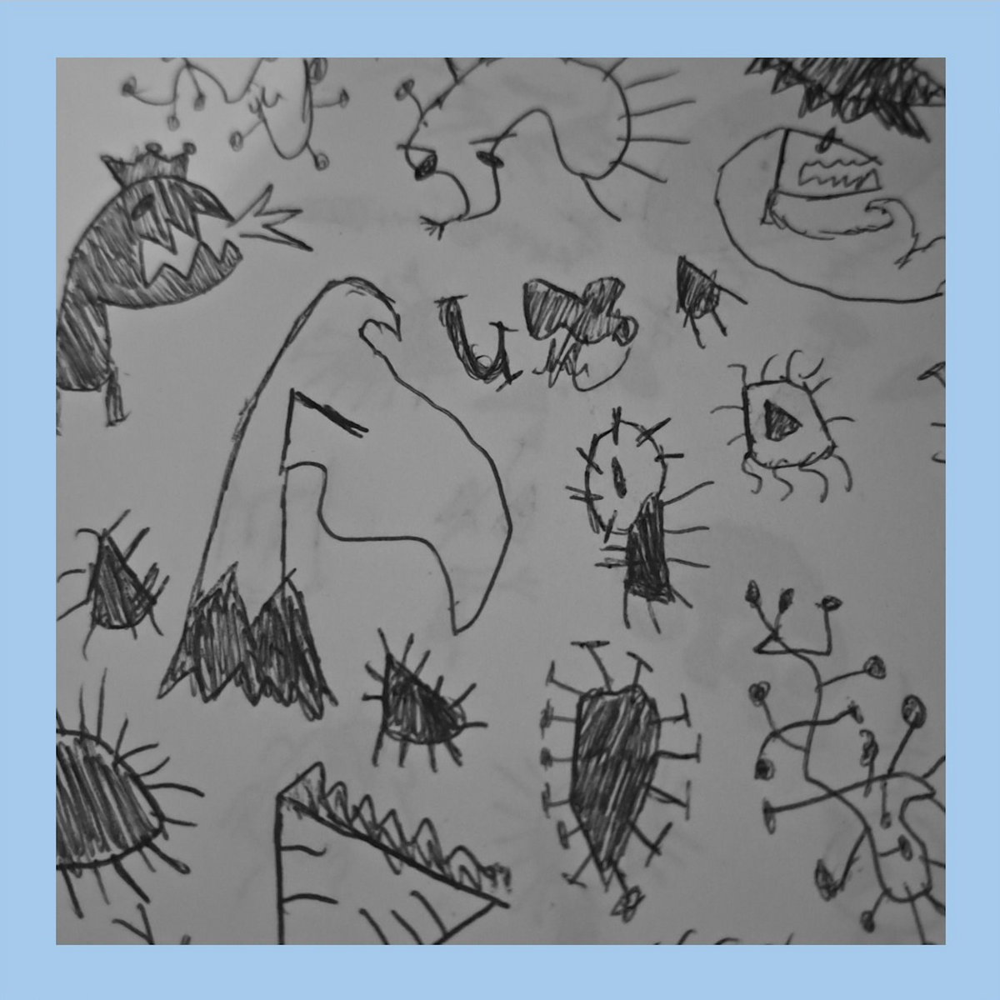
        <a/>
    

### A frightening discovery (2026.08.09)

    

        

            I didn't know that <a href="https://xoark.bandcamp.com/album/satellits-descriptor">Satellits: Descriptor</a> is an entry in a series of albums. Today, after I finished my morning jog while listening to <a href="https://xoark.bandcamp.com/album/turphrwak">Turphrwak</a> - my life is completely inundated with XoArK by this point - I found <a href="https://xoark.bandcamp.com/album/satellits-placements">Satellits: Placements</a>, and <a href="https://xoark.bandcamp.com/album/satellits-descriptions">Satellits: Descriptions</a>. Guess what ya boi will listen to next.
              
            Lil update; I'm at the point where I want to relisten to some of the albums. So I added a column for amount of listens to the album tracker table. Might remove it if I get too lazy to keep it up to date.
        

    

    

        <a href="https://xoark.bandcamp.com/album/turphrwak">
            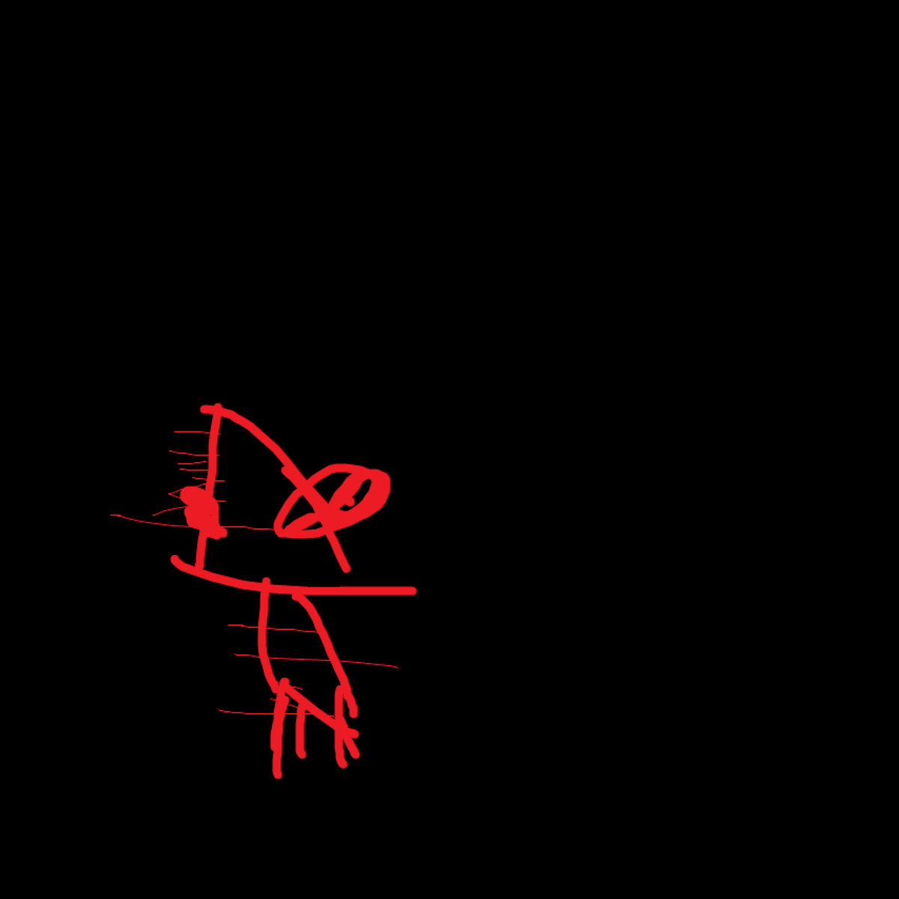
        <a/>
    

### XoArK Cinematic Universe (2026.08.09)

There's a pattern in the album covers. You can use this to determine with relative certainty what genre you're going to be listening to for the next hour.
- Does the cover feature a loli (often superimposed on a fish or bird)? If yes, then it's breakcore or ["so called drum & bass"](https://bandcamp.com/discover/so-called-%22drum-bass%22)
- Does the cover have a low-res filter? Or does it consist of a few shapes + color combinations. Then it's gonna be somewhat chill experimental IDM or ambient.
- Does the cover feature one of XoArK's notebook creatures? Then its most likely hectic IDM.
- Does the cover feature a picture of an image file or file dialogue (like Windows Explorer)? Then I have no idea. Ask me in the future.

### XoArK Cinematic Universe 2: Pattern recognition overload (2026.08.09)

I didn't realize until now, but there are a lot of XoArK "series" / "groups" of albums. It would be immediately obvious if the catalogue of releases wasn't so huge. But, since it is its easy to miss. I'll be listing a few of the ones I've found. Note that there might be missing releases in these "series" since XoArK will sometimes put them on different labels. Additionally, since I haven't listened to most of these I won't try to describe them.

**Satellits**:

1. Satellits: Placements (2023)
2. Satellits: Descriptions (2023)
3. Satellits: Descriptor (2025)

**The p/P()~()8\*n series**
1) P()~()..8 (2021)
2) P()~()..16 (2021)
3) P()~()..24 (2022)
4) P()~()..32 (2022) (this one is on the suicide.moe label)
5) P()~()..40 (2023)
6) P()~()..48 (2023)
7) P()~()..56 (2025)

<a href="https://xoark.bandcamp.com/album/p-56">
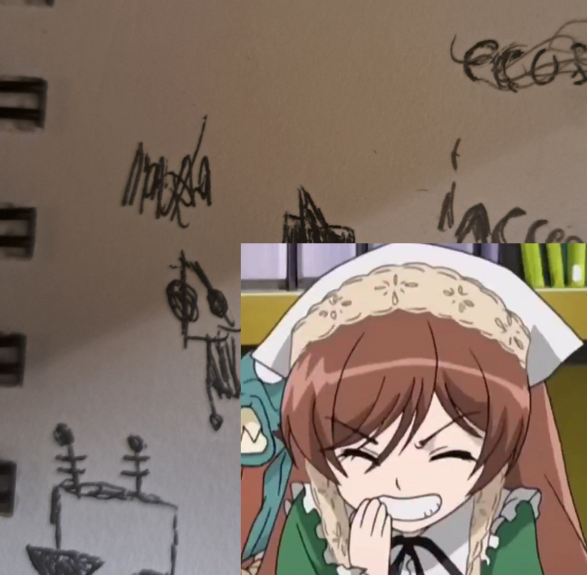
</a>

**praspis series**
1) praspis0, "Reset_All"
1) praspis1, "please mind the allocation of resources"
2) praspis2, "inf:"
3) praspis3, "it does lethal damage"

Apparently praspis3 was a live set. Wish I was there man.

<a href="https://xoark.bandcamp.com/album/praspis1-please-mind-the-allocation-of-resources">
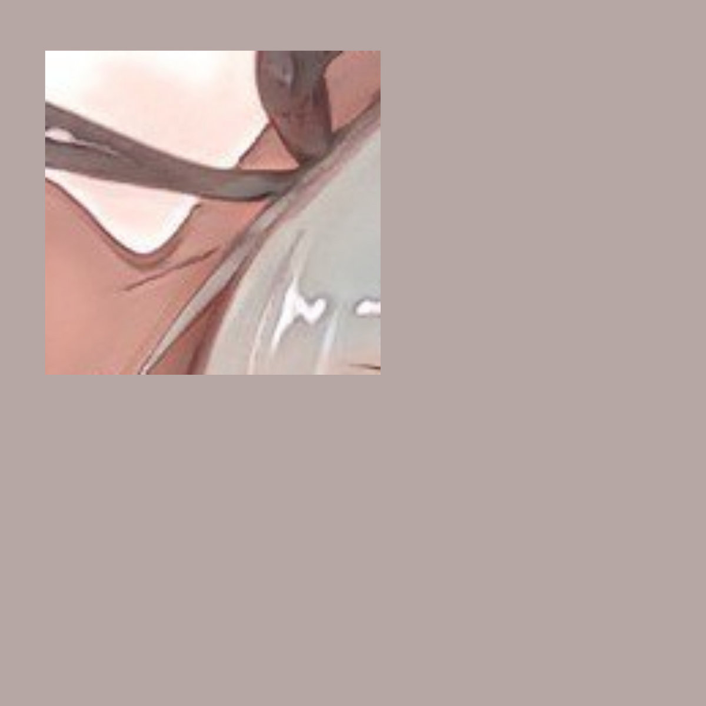
</a>

**missing / broken "series"**

These are weird. They're a common pattern. The name of the work generally reflects some software failure. Like: "image could not be displayed successfully". Not entirely sure if they should be grouped together or if they should be seen as something else.
I'd have trouble listing them all so I'll just give a few examples.
- [Something went wrong in this section of the page](https://xoark.bandcamp.com/album/something-went-wrong-in-this-section-of-the-page)
- [This item is no longer available. Items may be taken down for various reasons, including by decision of the uploader or due to a violation of our Terms of Use.](https://xoark.bandcamp.com/album/this-item-is-no-longer-available-items-may-be-taken-down-for-various-reasons-including-by-decision-of-the-uploader-or-due-to-a-violation-of-our-terms-of-use)
- [\[internally suppressed reference\] \[explorer_2022-10-08_02.04.36\]](https://xoark.bandcamp.com/album/internally-suppressed-reference-explorer-2022-10-08-020436)

**gnocchi series**

According to the descriptions on BC it seems like these are all improv

1) gnocchi-filereader
2) gnocchi-seems_to_be_a_reference vector
3) gnocchi baby kawm;lompy

**image hash series**

These singles / two-song releases have titles that look like part of an image hash. Maybe its possible to combine them. Idk. There are so many of these I'm not gonna bother listing them.

Yes, I did try decoding. But to no avail.

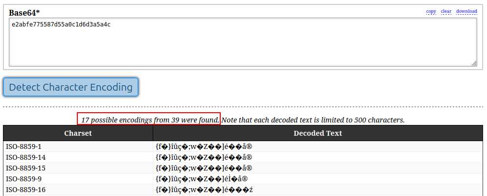

**color hex series**

Albums titled after hex colors

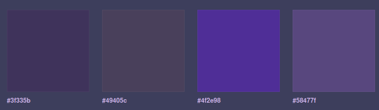

There's also the Screenshot_\[METADATA\] albums, and similarly there's the albums named X tracks, \[RUNTIME\].

There are so many of these. At some point I might make a separate page with all of the ones I find so that I can map the territory better.
